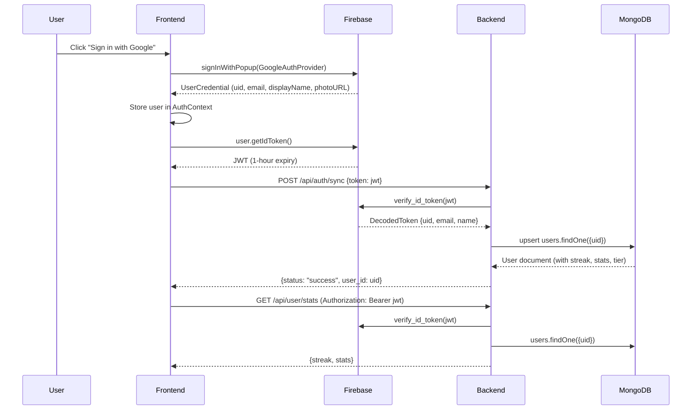

# 12. Detailed Technical Specifications (Tech-Spec)

> **Version:** 1.0 | **Date:** 2026-09-03

---

## 12.1 Dependency Manifest

### Frontend (`frontend/package.json`)
| Package | Version | Purpose |
|---|---|---|
| `react` | 19.0.0 | UI framework |
| `react-dom` | 19.0.0 | DOM rendering |
| `vite` | 5.4.x | Build tool & dev server |
| `typescript` | 5.5.x | Type system |
| `tailwindcss` | 4.0.x | Utility-first CSS framework |
| `lucide-react` | 0.400.x | Icon library |
| `firebase` | 10.14.x | Authentication client SDK |

### Backend (`backend/requirements.txt`)
| Package | Version | Purpose |
|---|---|---|
| `fastapi` | 0.115.x | API framework |
| `uvicorn[standard]` | 0.30.x | ASGI server |
| `motor` | 3.5.x | Async MongoDB driver |
| `pydantic` | 2.9.x | Request/response validation |
| `python-dotenv` | 1.0.x | Environment variable loading |
| `httpx` | 0.27.x | Async HTTP client |
| `firebase-admin` | 6.5.x | Firebase server-side auth |
| `google-genai` | 0.7.x | Gemini API client |
| `pytesseract` | 0.3.13 | OCR engine wrapper |
| `opencv-python-headless` | 4.10.x | Image preprocessing |
| `Pillow` | 10.4.x | Image I/O and manipulation |
| `razorpay` | 1.4.x | Payment gateway SDK |

---

## 12.2 API Endpoint Contracts

### `POST /api/scan` — Vision AI Food Scan
```
Request:
  Headers: Content-Type: application/json
           Authorization: Bearer <token>  (optional)
  Body: { "image": "data:image/jpeg;base64,..." }

Success Response (200):
  {
    "name": "Maggi Masala Noodles",
    "safety_score": 52,
    "ingredients": [
      {"name": "Refined Wheat Flour", "safety": "Moderate", "description": "Maida-based processed flour"},
      {"name": "Palm Oil", "safety": "Moderate", "description": "High in saturated fats"}
    ],
    "warnings": ["Contains gluten", "High sodium content"]
  }

Non-Food Response (200):
  { "has_ingredients": false, "error_message": "Ingredients list not Detected, Scan Again." }

Error Response (429):
  { "detail": "Monthly scan quota exceeded. Please upgrade." }
```

### `POST /api/scan/ingredients` — OCR Label Scan
```
Request:
  Headers: Content-Type: application/json
           Authorization: Bearer <token>  (optional)
  Body: { "image": "data:image/jpeg;base64,..." }

Success Response (200):
  {
    "ingredients": ["Refined Wheat Flour", "Palm Oil", "Salt", "Sugar"],
    "additives": ["INS 627 (Disodium Guanylate)", "INS 631 (Disodium Inosinate)"],
    "allergens": ["Wheat (Gluten)"],
    "estimated_macros": {"calories": 340, "protein": 7, "carbs": 48, "fat": 14}
  }
```

### `GET /api/foods?search=<query>` — Food Search
```
Request:
  Query: search=paneer (optional, empty returns top 50)

Success Response (200): Array of FoodItem objects
  [
    {
      "_id": "66a1b2c3d4e5f6a7b8c9d0e1",
      "name": "Paneer Butter Masala",
      "brand": "Homemade",
      "safety_score": 82,
      "status": "Safe",
      "ingredients": [{"name": "Paneer", "safety": "Safe", "description": "Fresh cottage cheese"}],
      "warnings": []
    }
  ]
```

### `GET /api/user/stats` — Daily Statistics
```
Request:
  Headers: Authorization: Bearer <token>  (required)

Success Response (200):
  {
    "streak": 5,
    "stats": {"calories": 1200, "protein": 45, "carbs": 130, "fat": 40, "last_updated": "2026-09-03"}
  }
```

### `POST /api/user/log_meal` — Log Meal with AI Macro Estimation
```
Request:
  Headers: Authorization: Bearer <token>  (required)
  Body: { "name": "Paneer Butter Masala", "ingredients": [{"name": "Paneer"}, {"name": "Butter"}] }

Success Response (200):
  {
    "status": "success",
    "added_macros": {"calories": 350, "protein": 18, "carbs": 12, "fat": 25},
    "new_stats": {"calories": 1550, "protein": 63, "carbs": 142, "fat": 65, "last_updated": "2026-09-03"}
  }
```

### `POST /api/subscription/create` — Create Razorpay Subscription
```
Request:
  Headers: Authorization: Bearer <token>  (required)
  Body: { "plan": "pro" }

Success Response (200):
  {
    "subscription_id": "sub_TJnZj0mYVfrW7N",
    "plan_id": "plan_TJncvgHhDOKAaA",
    "status": "created"
  }
```

---

## 12.3 Authentication Flow


