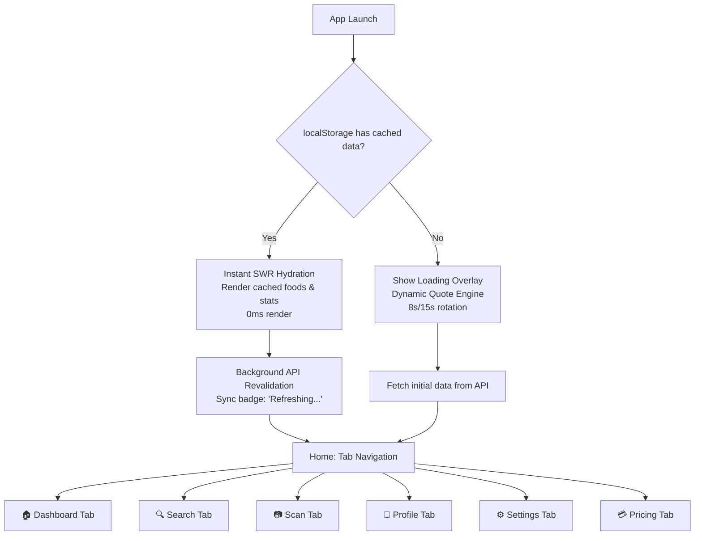
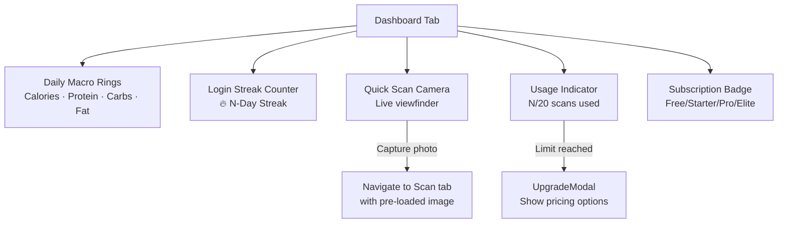
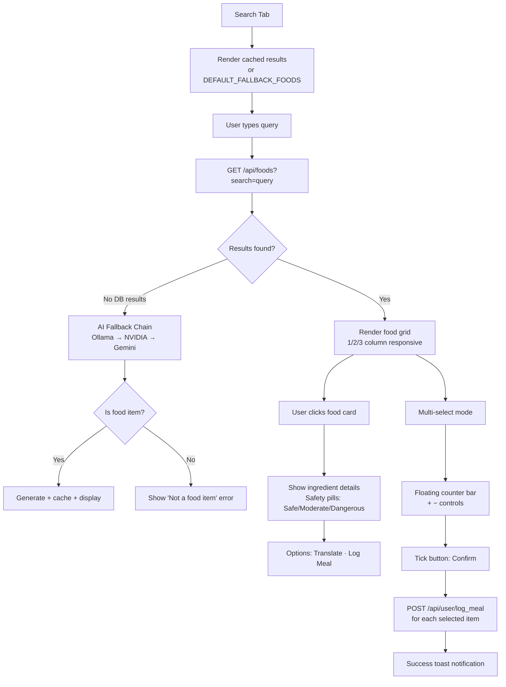
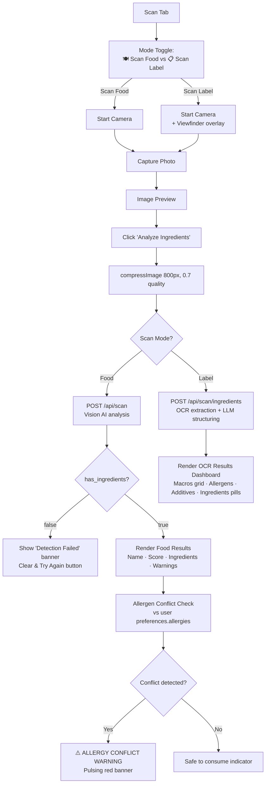
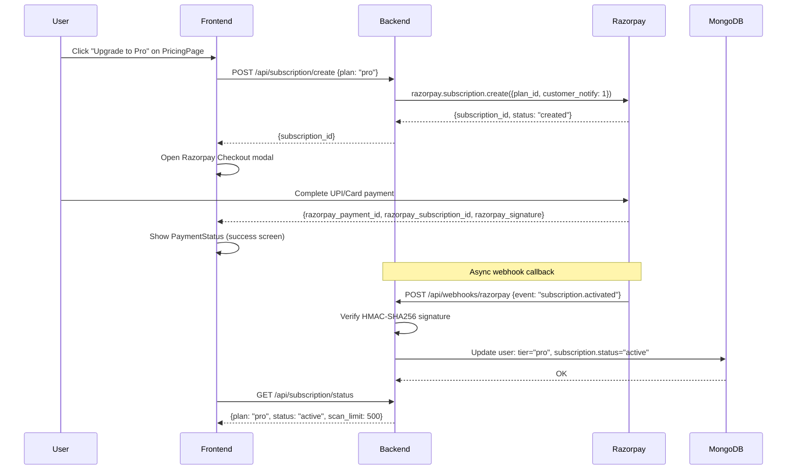

# 13. End-to-End App Flow (appFlow)

> **Version:** 1.0 | **Date:** 2026-09-03

---

## 13.1 Master Navigation Flow



---

## 13.2 Dashboard Flow



---

## 13.3 Search Flow



---

## 13.4 Camera OCR Scan Flow



---

## 13.5 Health Profile Vault Flow

```mermaid
graph TD
    K[Profile Tab] --> K1[Display health_profile<br/>Age · Gender · Height · Weight]
    K --> K2[Display preferences<br/>Diet type · Allergies list]
    K --> K3[Subscription Badge]
    
    K1 --> K4[Click 'Edit Health Profile']
    K4 --> K5[Toggle input fields<br/>Age, Gender, Height, Weight]
    K5 --> K6[Save]
    K6 --> K7[POST /api/user/profile<br/>{health_profile: {...}}]
    
    K2 --> K8[Click 'Configure Dietary Preferences']
    K8 --> K9[DietaryPreferencesModal<br/>Diet: Vegetarian/Vegan/Keto/Halal<br/>Allergies: Peanuts/Soy/Gluten/Dairy/+Custom]
    K9 --> K10[Save]
    K10 --> K7
```

---

## 13.6 Razorpay Subscription Upgrade Flow


