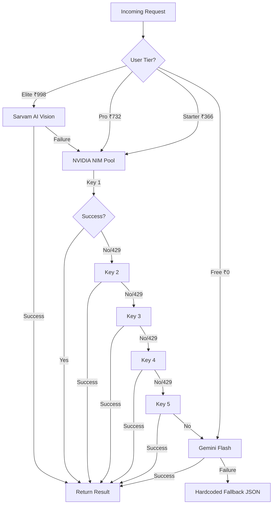
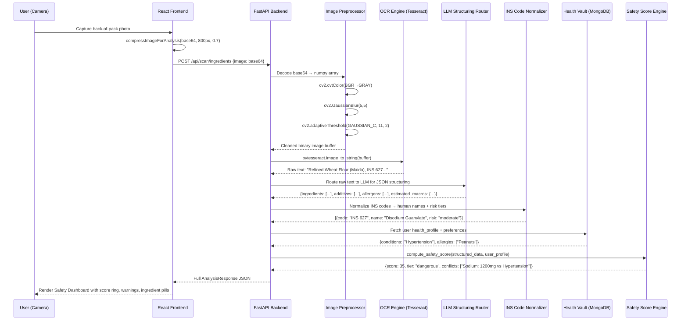
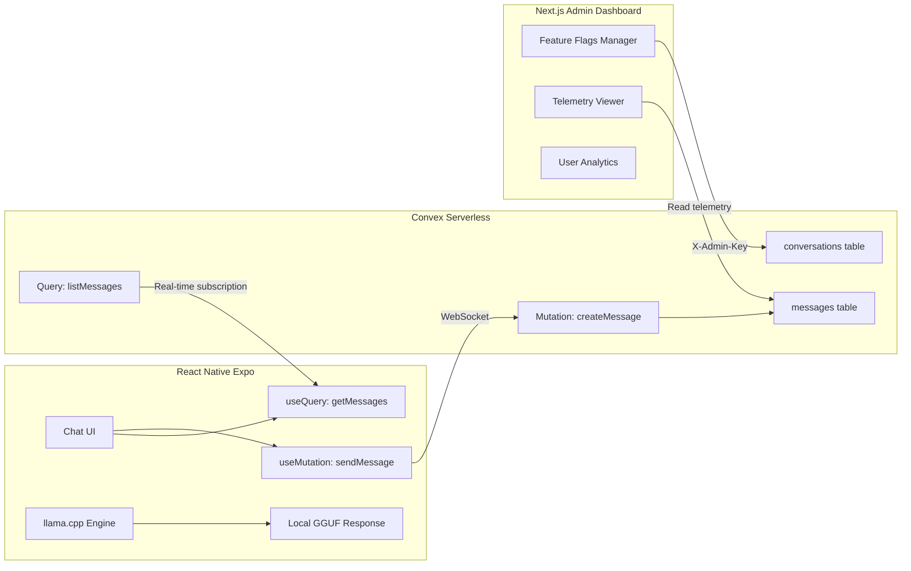

# 2. System Architecture — Z-SeHealth + Z-AI Chatbot

> **Version:** 1.0 | **Date:** 2026-09-03

---

## 2.1 Macro-Architecture Overview

The system is composed of three deployment tiers communicating over HTTPS and WebSocket:

```
┌─────────────────────────────────────────────────────────────────────────┐
│                        EDGE CLIENT LAYER                                │
│  ┌──────────────────┐  ┌──────────────────┐  ┌──────────────────────┐  │
│  │ React Web (Vite) │  │ React Native     │  │ Next.js Admin        │  │
│  │ z-sehealth.app   │  │ Expo Mobile App  │  │ Dashboard            │  │
│  │ SWR + localStorage│ │ llama.cpp GGUF   │  │ X-Admin-Key header   │  │
│  └────────┬─────────┘  └────────┬─────────┘  └────────┬─────────────┘  │
└───────────┼──────────────────────┼──────────────────────┼───────────────┘
            │ HTTPS                │ HTTPS/WS             │ HTTPS
┌───────────▼──────────────────────▼──────────────────────▼───────────────┐
│                     BACKEND SERVICE LAYER                                │
│  ┌──────────────────────────────────────────────────────────────────┐   │
│  │                    FastAPI (Python 3.11)                          │   │
│  │  ┌────────────┐  ┌─────────────┐  ┌──────────────┐              │   │
│  │  │ /api/scan/* │  │ /api/foods  │  │ /api/user/*  │              │   │
│  │  │ OCR Engine  │  │ Search+AI   │  │ Auth+Stats   │              │   │
│  │  └─────┬──────┘  └──────┬──────┘  └──────┬───────┘              │   │
│  │        │                │                 │                       │   │
│  │  ┌─────▼────────────────▼─────────────────▼──────────┐           │   │
│  │  │          Multi-LLM Failover Router                 │           │   │
│  │  │  Tier 1: Ollama/Sarvam → Tier 2: NVIDIA (5 keys)  │           │   │
│  │  │  → Tier 3: Gemini Flash/2.0                        │           │   │
│  │  └───────────────────────────────────────────────────┘           │   │
│  └──────────────────────────────────────────────────────────────────┘   │
└───────────┬──────────────────────┬──────────────────────┬───────────────┘
            │                      │                      │
┌───────────▼──────────┐ ┌────────▼────────┐ ┌───────────▼───────────────┐
│ MongoDB Atlas        │ │ Firebase Auth   │ │ Convex Serverless Cloud   │
│ Collections:         │ │ Google OAuth    │ │ conversations, messages    │
│ foods, users         │ │ Email/Password  │ │ Real-time sync             │
└──────────────────────┘ └─────────────────┘ └───────────────────────────┘
```

---

## 2.2 Multi-LLM Failover Router — Detailed Architecture

### Routing Strategy
The router implements a cascading failover pattern. Each tier is attempted sequentially. On success, the result is returned immediately. On failure (timeout, 429, 5xx, malformed response), execution falls through to the next tier.



### NVIDIA Key Pool Configuration
```python
# Environment: NVIDIA_API_KEY, NVIDIA_API_KEY_1 through NVIDIA_API_KEY_5
# get_nvidia_keys() deduplicates and returns List[str]
# Each key has independent rate limits (~100 req/min)
# Total pool capacity: ~500 req/min sustained
```

---

## 2.3 OCR-to-Safety-Score Pipeline



---

## 2.4 Convex Cloud Sync Architecture (Z-AI Chatbot)



---

## 2.5 Open Food Facts Proxy

```python
# Flow: User searches → MongoDB first → OFF API enrichment → AI fallback
# 1. Query local MongoDB foods collection
# 2. If no results, query Open Food Facts API with barcode/name
# 3. If OFF returns data, inject FSSAI-specific metadata:
#    - Map OFF additives to INS risk classifications
#    - Apply Indian dietary context (vegetarian markers, Jain restrictions)
# 4. Cache enriched result in MongoDB for future queries
# 5. If OFF also fails, trigger the multi-LLM AI fallback chain
```
