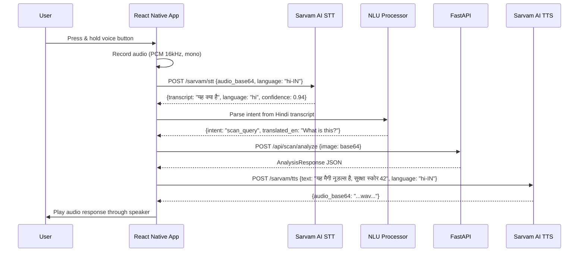

# 8. Vernacular Voice Interface Architecture

> **Version:** 1.0 | **Date:** 2026-09-03

---

## 8.1 End-to-End Voice Pipeline



## 8.2 Supported Indian Dialects

| Language | ISO Code | Sarvam Model | OCR Support |
|---|---|---|---|
| Hindi | hi-IN | `sarvam-stt-hi-v1` | Devanagari script |
| Tamil | ta-IN | `sarvam-stt-ta-v1` | Tamil script |
| Telugu | te-IN | `sarvam-stt-te-v1` | Telugu script |
| Bengali | bn-IN | `sarvam-stt-bn-v1` | Bengali script |
| Marathi | mr-IN | `sarvam-stt-mr-v1` | Devanagari script |
| Gujarati | gu-IN | `sarvam-stt-gu-v1` | Gujarati script |
| Kannada | kn-IN | `sarvam-stt-kn-v1` | Kannada script |
| Malayalam | ml-IN | `sarvam-stt-ml-v1` | Malayalam script |
| Punjabi | pa-IN | `sarvam-stt-pa-v1` | Gurmukhi script |
| Odia | or-IN | `sarvam-stt-or-v1` | Odia script |

## 8.3 Audio Recording Specifications

| Parameter | Value | Rationale |
|---|---|---|
| Sample Rate | 16,000 Hz | Optimal for speech recognition, minimal bandwidth |
| Channels | Mono | Single speaker input, reduces payload size by 50% |
| Bit Depth | 16-bit PCM | Standard for STT engines |
| Max Duration | 15 seconds | Prevents excessive API costs; most food queries are < 5s |
| Format | WAV (uncompressed) | Maximum STT accuracy; compress to Opus for transmission |
| Buffer Flush | Immediate after processing | No raw audio persists in storage or logs |

## 8.4 Natural Language Understanding (NLU) — Intent Classification

| Intent | Example Phrases (Hindi) | Mapped Action |
|---|---|---|
| `scan_query` | "यह क्या है", "इसमें क्या है" | Trigger camera → scan |
| `search_food` | "पनीर बटर मसाला दिखाओ" | Search API call |
| `check_safety` | "क्या यह मेरे लिए सुरक्षित है" | Scan + Health vault cross-ref |
| `log_meal` | "यह खाना लॉग करो" | Log meal API call |
| `read_score` | "स्कोर बताओ" | Read last scan result aloud |

## 8.5 Audio Safety Feedback Format

When a dangerous product is detected, the TTS response follows this template:
```
"चेतावनी! {product_name} का सुरक्षा स्कोर {score} है।
{conflict_count} चिकित्सा संघर्ष पाए गए।
{conflict_1}: {reason_1}।
{conflict_2}: {reason_2}।
कृपया यह उत्पाद न खाएं।"
```

Translation:
```
"Warning! {product_name} has a safety score of {score}.
{conflict_count} medical conflicts found.
{conflict_1}: {reason_1}.
{conflict_2}: {reason_2}.
Please do not consume this product."
```
